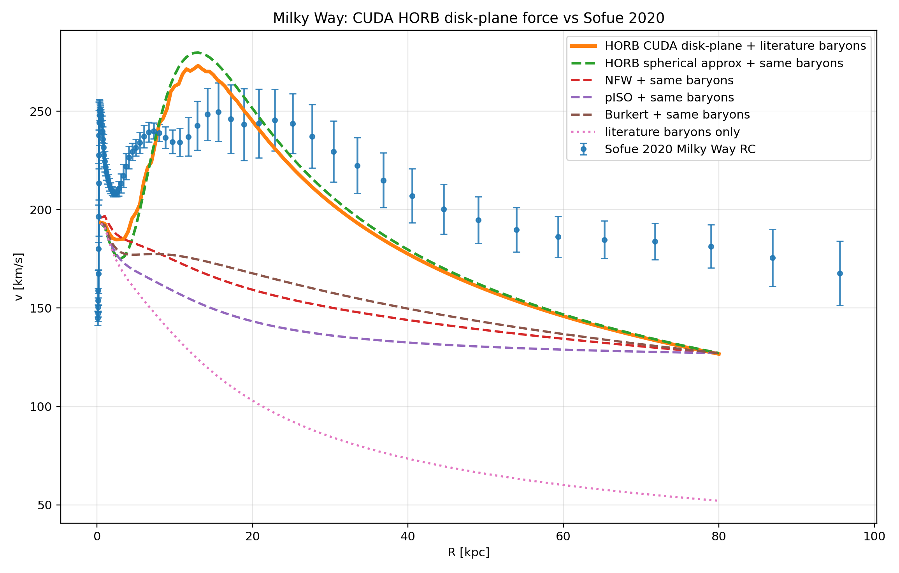

# horb - Hydrogenic Orbital Radial Basis

Rust/CUDA Simulation Suite For Testing Hydrogen Electron Orbitals As Spiral Galaxy Dark Matter Halos

## Current Best Result

The current best Milky Way candidate is a morphology-constrained hydrogenic `3d_z2` halo tested against the Sofue 2020 unified Milky Way rotation curve using a literature bulge+disk baryonic model and a CUDA direct-summation disk-plane force calculation.

| Parameter | Value |
|---|---:|
| Orbital state | `3d_z2` |
| Orbital scale `a0_star` | `1.0 kpc` |
| HORB dark halo mass | `2.5e11 M_sun` |
| HORB force model | CUDA disk-plane direct summation |
| Grid size | `96^3` mass cells |
| Grid extent | `±80 kpc` |
| Softening length | `0.25 kpc` |
| Baryon model | Sofue literature bulge+disk |
| Stellar disk mass | `3.41e10 M_sun` |
| Stellar disk scale | `3.19 kpc` |
| Bulge mass | `1.652e10 M_sun` |
| Bulge scale | `0.522 kpc` |

Using the same literature baryonic model for every halo, the CUDA HORB candidate is compared directly against the previous spherical HORB approximation and against NFW, pseudo-isothermal, and Burkert halo baselines, with all curves plotted against the Sofue 2020 unified Milky Way rotation curve.



This benchmark replaces the earlier spherical-enclosed-mass approximation. The CUDA calculation evaluates the actual disk-plane gravitational response of the non-spherical `3d_z2` orbital density field. The result lowers the mid-radius HORB peak relative to the spherical approximation, which is exactly the region where the spherical model overshot the observed Milky Way rotation curve.

The plot is generated reproducibly by:

```bash
LD_LIBRARY_PATH="$PWD/cuda_kernels/cuda:${LD_LIBRARY_PATH:-}" \
cargo run -p cuda_kernels --bin test_horb_disk_plane_curve -- \
  1.0 2.5e11 96 80 0.25

cargo run -q -p curve_fitter -- compare_dm_fixed_baselines \
  3d_z2 1.0 2.5e11 2.5e11 \
  5.0 15.0 8.0 80.0 \
  > curves/spherical_horb_compare_a1.0_m2.5e11.csv

./scripts/plot_cuda_total_vs_mw.py \
  --cuda-csv curves/cuda_horb_diskplane_a1.000_m2.500e11_n96.csv \
  --dm-compare-csv curves/spherical_horb_compare_a1.0_m2.5e11.csv \
  --rc-csv data/milky_way/sofue_2020_standard_rc.csv \
  --baryons-csv data/milky_way/sofue_literature_baryons.csv \
  -o plots/mw_cuda_horb_diskplane_total_vs_sofue2020.png
```


## Motivation

Standard computational astrophysics models spiral-galaxy dark-matter halos using smooth, parametric density curves (e.g., NFW, Burkert, Einasto). While these phenomenological profiles function as flexible data-fitting forms, they are rarely constrained by independent, non-spherical geometric observables. 

The **HORB** (`Hydrogenic Orbitals Radial Basis`) engine is built to test a radically different, morphology-first alternative: evaluating whether a scaled hydrogenic orbital density field centered on the Galactic core can simultaneously resolve macroscopic geometry (Fermi Bubbles) and dynamics (Flat Rotation Curves). Preliminary morphology indicates that the real angular probability density of the hydrogen $3d_{z^2}$ orbital:

$$\rho_{\Omega}(\theta) \propto \left(3\cos^2\theta - 1\right)^2$$

reproduces the distinctive bipolar lobe geometry, equatorial waist, and $54.74^\circ$ nodal cone opening structure of the Milky Way's Fermi bubbles. 

### The Fractal Connection
The broader theoretical framework driving this investigation is detailed in the accompanying independent ontology paper:

> **[The Fact of Fractal Tennis: The Universe As A Fractal Computer Defined by the Star=Electron+Atom=Galaxy Quine (arXiv/viXra:2605.0003)](https://ai.vixra.org/abs/2605.0003)**

In the TFOFT framework, the universe operates as a recursive, self-similar scale hierarchy. Under this identity, what macro-astrophysics labels as "exotic dark matter" is physically composed of sub-scale hydrogen gas clouds, which is sitting at the threshold of electron-generating micro-fusion at the Fermi Bubbles. 

This hypothesis yields three concrete, independently falsifiable predictions that this software is engineered to test:
1. **Morphology:** Does the $3d_{z^2}$ boundary template quantitatively match the observed Fermi bubble outlines? Initial analysis says YES!
2. **Dynamics:** Does the morphology-constrained density field yield a competitive galactic circular-velocity curve ($v_c$) contribution without over-parameterization?
3. **Substrate Density:** Does the internal X-ray surface brightness distribution within the Fermi lobes trace the predicted $3d_{z^2}$ internal density matrix?

**HORB** does not assume the validity of the TFOFT ontology *a priori*. Instead, it provides the high-performance Rust/CUDA pipeline required to subject its core macro-scale predictions to rigorous algorithmic stress-testing, benchmarking the results directly against legacy astrophysics profiles.


## TFOFT Update

TFOFT may have gotten the ontology wrong.

The dark matter halos generating electrons makes it the actual negative charge component of the galaxy at the human scale, so since electron clouds are electron orbitals, the electrons themselves are most likely a dark-matter type of object. Stellar Mass "black holes" may be a candidate for electrons. This means in TFOFT2 a star is a positron. This solves the matter-antimatter asymmetry as macro-protons being the galactic core generated by stellar support, so at the atomic scale, protons are composite objects made from positron support. But in regulaor TFOFT, there is not matter-antimatter issue because it's just absorption vs emission at giant scale

I am 85% sure stars are electrons and 15% sure stars are positrons, mostly due to the photonic mechnaism . 

## CUDA Build Note

The CUDA shared library `libhorb_cuda.so` is intentionally ignored by git because it is a local build artifact. On a fresh clone, build it before running CUDA tests:

```bash
cd cuda_kernels/cuda
./build.sh
cd ../..
LD_LIBRARY_PATH="$PWD/cuda_kernels/cuda:${LD_LIBRARY_PATH:-}" cargo test
```

## License

This project is dual-licensed under either:

* Apache License, Version 2.0 ([LICENSE-APACHE](LICENSE-APACHE) or http://www.apache.org/licenses/LICENSE-2.0)
* MIT license ([LICENSE-MIT](LICENSE-MIT) or http://opensource.org/licenses/MIT)

at your option.
