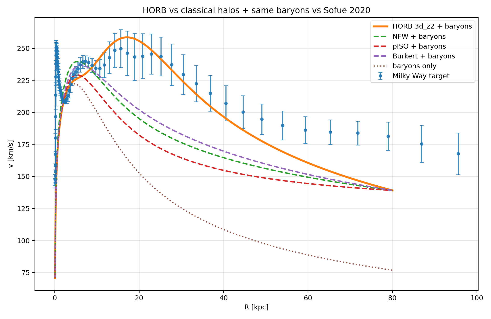

# horb - Hydrogenic Orbital Radial Basis

Rust/CUDA Simulation Suite For Testing Hydrogen Electron Orbitals As Spiral Galaxy Dark Matter Halos

## Current Best Result

The current best candidate is a morphology-constrained hydrogenic `3d_z2` halo with:

| Parameter | Value |
|---|---:|
| Orbital state | `3d_z2` |
| Orbital scale `a0_star` | `1.5 kpc` |
| HORB dark halo mass | `2.5e11 M_sun` |
| Toy disk mass | `1e11 M_sun` |
| Toy disk scale | `3.0 kpc` |
| Toy bulge mass | `1e10 M_sun` |
| Toy bulge scale | `0.7 kpc` |

Using the same baryonic model for every halo, the HORB candidate is compared directly against NFW, pseudo-isothermal, and Burkert halo baselines, with all curves plotted against the Sofue 2020 unified Milky Way rotation curve.



This result is the first core benchmark of the project: the same `a0_star ≈ 1.5 kpc` scale that lands in the Fermi-bubble morphology band also produces a competitive Milky Way circular-velocity curve when combined with the toy baryonic model.

The plot is generated reproducibly by:

```bash
./scripts/run_best_candidate_total_model_comparison.sh
```

The current scoring reports are written to:

```text
reports/best_candidate_total_models_score_inner.csv
reports/best_candidate_total_models_score_all.csv
```


## Motivation

Standard computational astrophysics models spiral-galaxy dark-matter halos using smooth, parametric density curves (e.g., NFW, Burkert, Einasto). While these phenomenological profiles function as flexible data-fitting forms, they are rarely constrained by independent, non-spherical geometric observables. 

The **HORB** (`Hydrogenic Orbitals Radial Basis`) engine is built to test a radically different, morphology-first alternative: evaluating whether a scaled hydrogenic orbital density field centered on the Galactic core can simultaneously resolve macroscopic geometry (Fermi Bubbles) and dynamics (Flat Rotation Curves). Preliminary morphology indicates that the real angular probability density of the hydrogen $3d_{z^2}$ orbital:

$$\rho_{\Omega}(\theta) \propto \left(3\cos^2\theta - 1\right)^2$$

reproduces the distinctive bipolar lobe geometry, equatorial waist, and $54.74^\circ$ nodal cone opening structure of the Milky Way's Fermi bubbles. 

### The Fractal Connection
The broader theoretical framework driving this investigation is detailed in the accompanying independent ontology paper:

> **[The Fact of Fractal Tennis: The Universe As A Fractal Computer Defined by the Star=Electron+Atom=Galaxy Quine (arXiv/viXra:2605.0003)](https://ai.vixra.org/abs/2605.0003)**

In the TFOFT framework, the universe operates as a recursive, self-similar scale hierarchy. Under this identity, what macro-astrophysics labels as "exotic dark matter" is physically composed of sub-scale hydrogen gas clouds, which is sitting at the threshold of electron-generating micro-fusion at the Fermi Bubbles. 

This hypothesis yields three concrete, independently falsifiable predictions that this software is engineered to test:
1. **Morphology:** Does the $3d_{z^2}$ boundary template quantitatively match the observed Fermi bubble outlines? Initial analysis says YES!
2. **Dynamics:** Does the morphology-constrained density field yield a competitive galactic circular-velocity curve ($v_c$) contribution without over-parameterization?
3. **Substrate Density:** Does the internal X-ray surface brightness distribution within the Fermi lobes trace the predicted $3d_{z^2}$ internal density matrix?

**HORB** does not assume the validity of the TFOFT ontology *a priori*. Instead, it provides the high-performance Rust/CUDA pipeline required to subject its core macro-scale predictions to rigorous algorithmic stress-testing, benchmarking the results directly against legacy astrophysics profiles.

## License

This project is dual-licensed under either:

* Apache License, Version 2.0 ([LICENSE-APACHE](LICENSE-APACHE) or http://www.apache.org/licenses/LICENSE-2.0)
* MIT license ([LICENSE-MIT](LICENSE-MIT) or http://opensource.org/licenses/MIT)

at your option.
